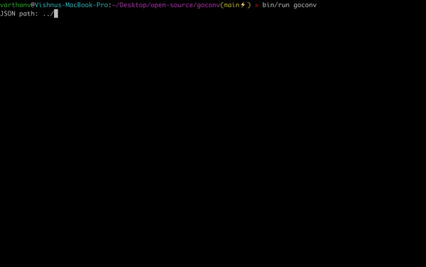

# goconv

npm link : [npmjs.com/package/gocon](npmjs.com/package/goconv)

A CLI tool to convert json to Golang structs and write it to a desired file of your choice

# Usage
<!-- usage -->
```sh-session
$ npm install -g goconv
$ goconv COMMAND
running command...
$ goconv (--version)
goconv/1.0.0 darwin-arm64 node-v17.8.0
$ goconv --help [COMMAND]
USAGE
  $ goconv conv
...
```
<!-- usagestop -->
```sh-session
$ npm install -g goconv
$ goconv COMMAND
running command...
$ goconv (--version)
goconv/0.0.0 darwin-arm64 node-v17.8.0
$ goconv --help [COMMAND]
USAGE
  $ goconv
```

# Demo


